
<h1 align="center">基于java的个性化图书推荐系统</h1>

## 简介
基于Java的个性化图书推荐系统，角色分为管理员和用户；提供书籍搜索、个性化推荐、用户信息管理、订单管理、图书信息维护等功能，支持用户登录注册，界面设计简洁现代。    --计算机毕业设计源码；毕设源码；java毕业设计源码

## 联系方式

<h3 align="center">获取完整代码与数据库文件 + 微信：deepguan QQ: 86050149 QQ群: 783742310</h3>

<h3 align="center">可帮忙远程部署 包运行成功！提供远程部署、修改代码、设计文档指导、代码讲解等服务！</h3>

## 功能介绍（完整见运行截图）
管理员：管理员可以通过登录界面进行身份验证，访问系统的各项管理功能。管理界面提供用户管理、图书分类管理、图书信息管理、系统管理和订单管理等模块，支持添加、修改和删除公告及订单信息。管理员还可以在图书信息管理界面中输入和管理图书的详细信息，以便在用户界面中实现个性化的图书推荐功能。系统具备的搜索和查询功能，帮助管理员高效地进行信息的查看和操作。

用户：用户通过登录界面进行身份验证，并可注册新账户或找回密码。用户界面包括首页、图书信息、公告信息、客服中心、购物车和个人中心等功能模块。用户可以浏览和搜索书籍信息，通过系统推荐获取个性化的阅读建议。在购物界面，用户可以选择图书、调整购买数量并确认订单，查看当前订单状态，管理收货地址等。个人中心允许用户编辑个人信息，包括账户信息和偏好设置，此外还支持查看和管理个人订单和收藏的书籍。

## 运行截图
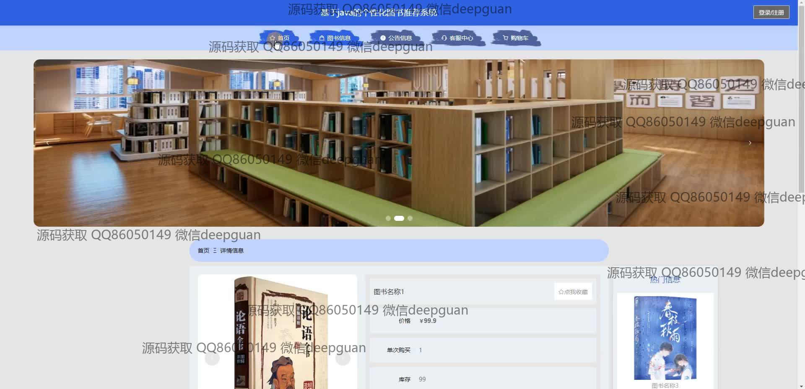

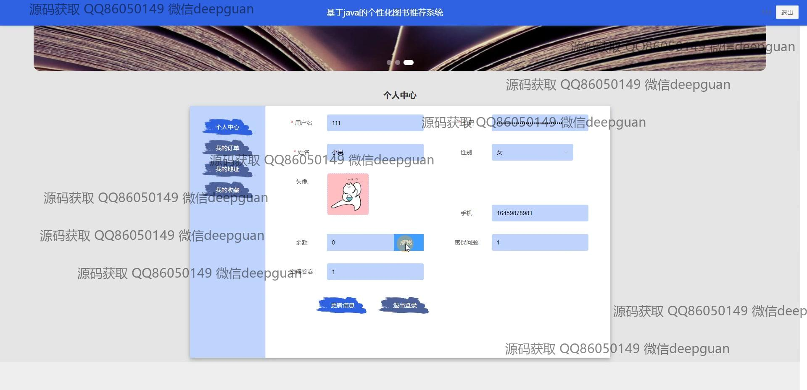
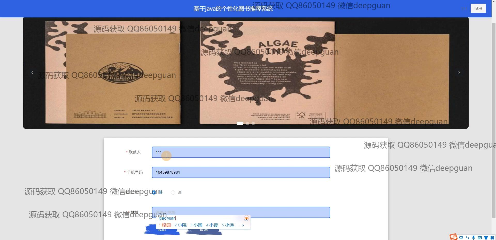
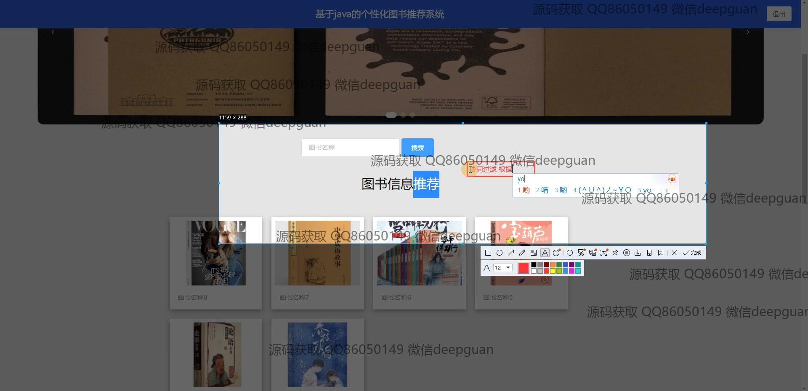
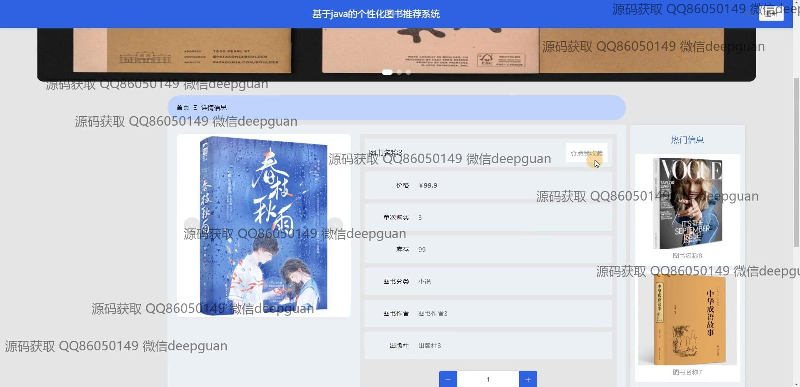
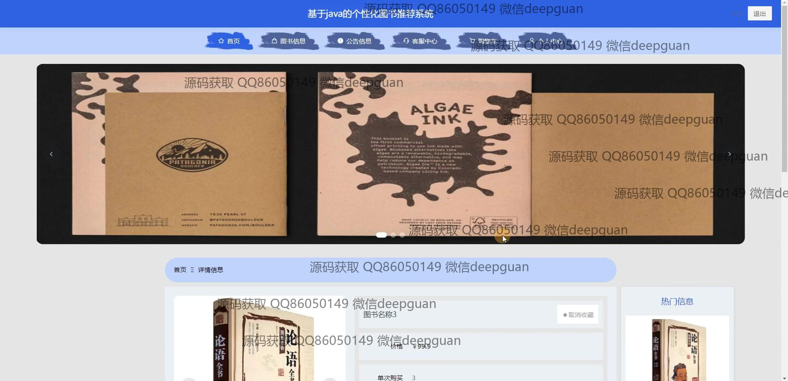
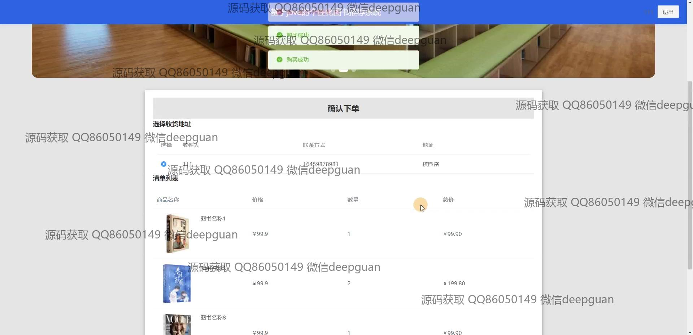
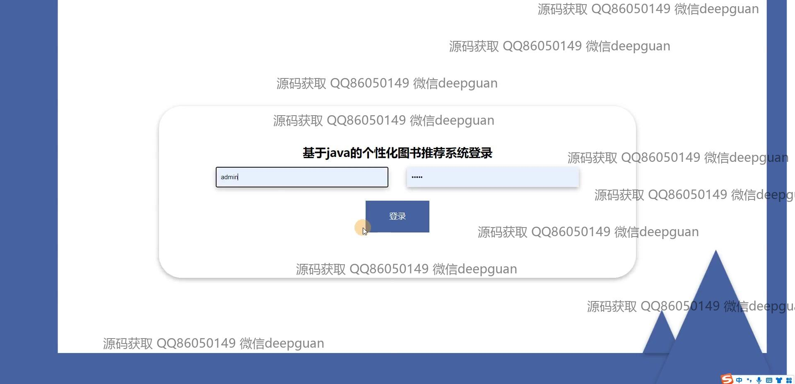
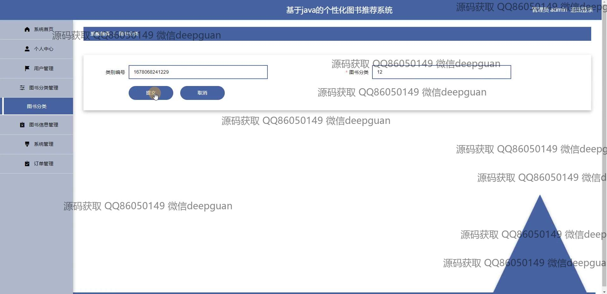
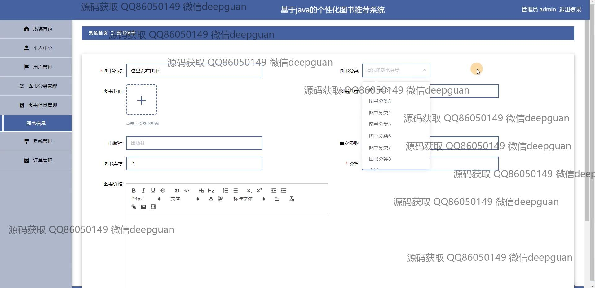
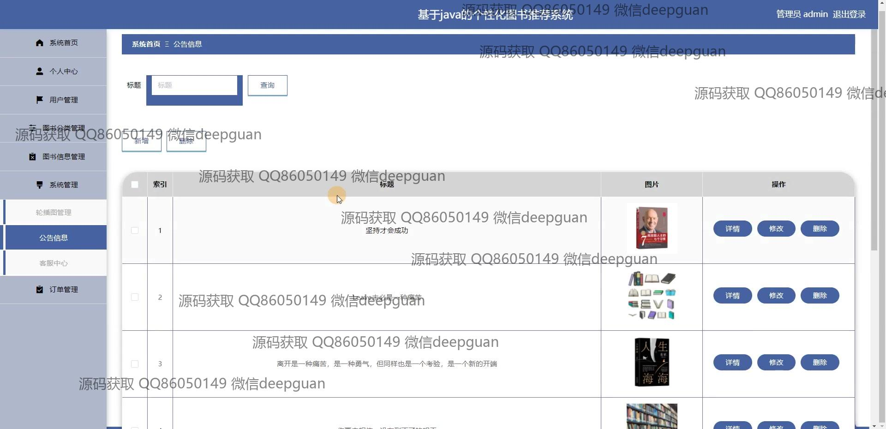
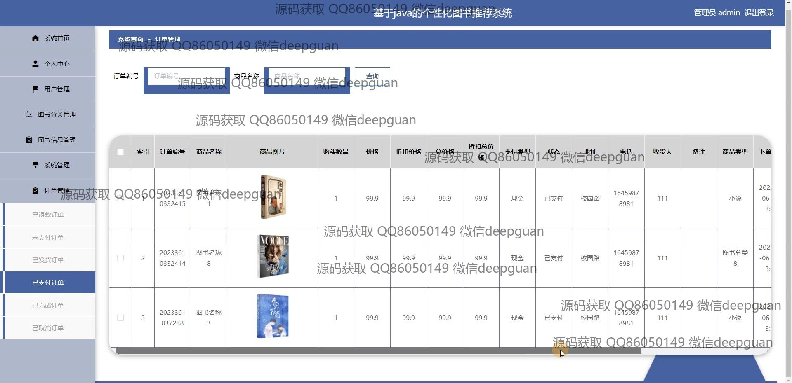
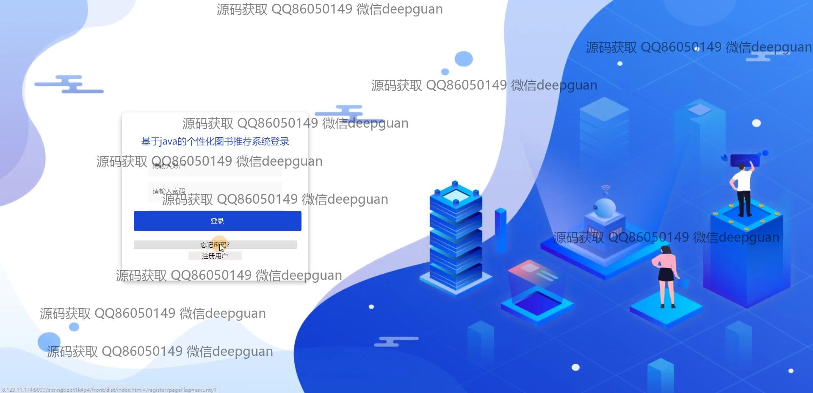
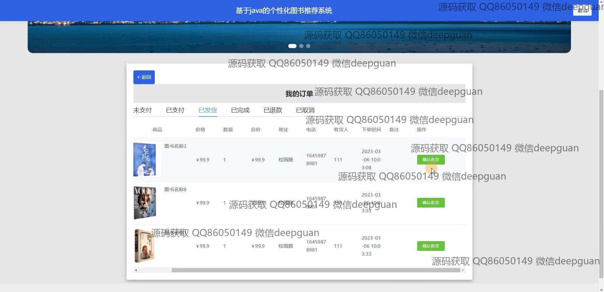
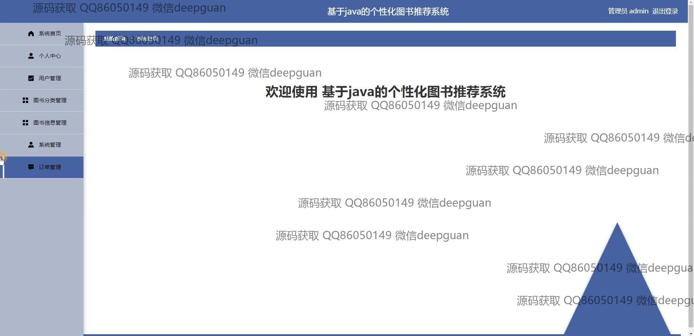
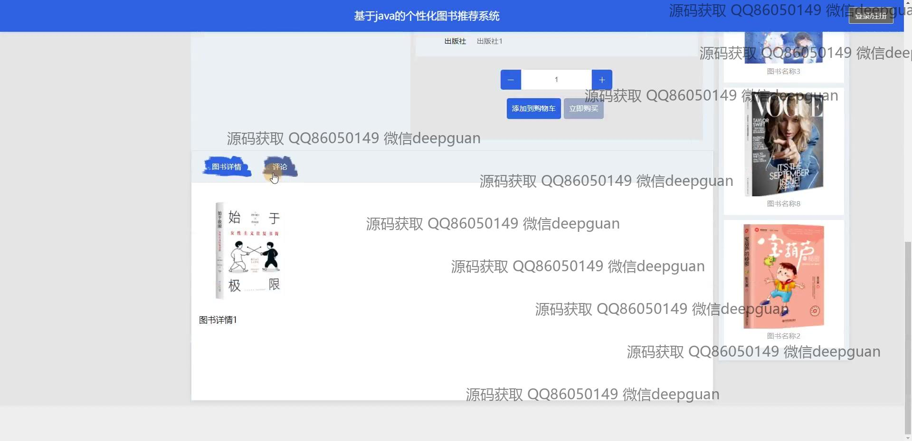

本代码来源于网络,仅供学习参考使用!

